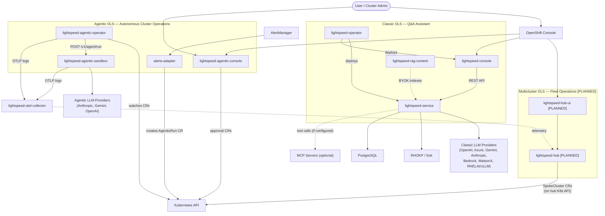
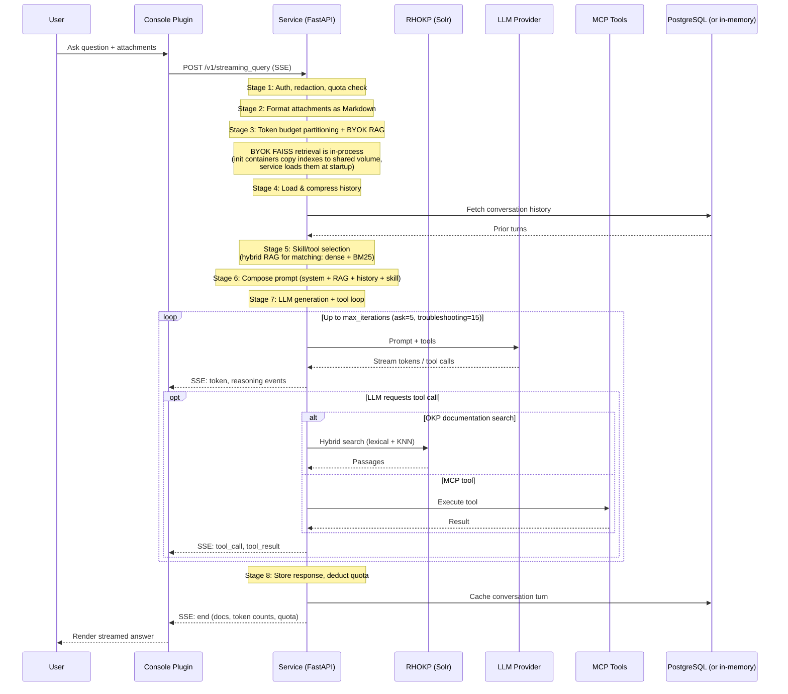
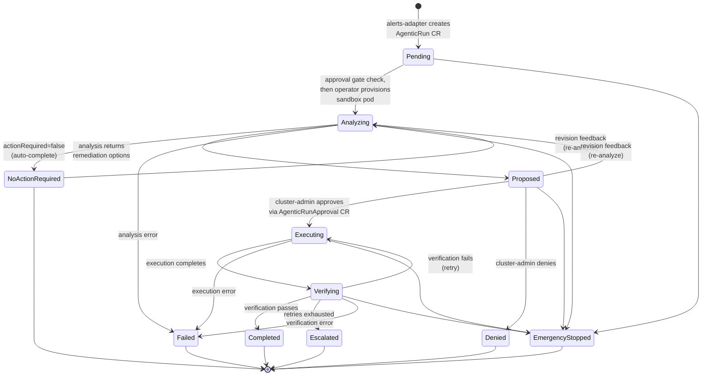
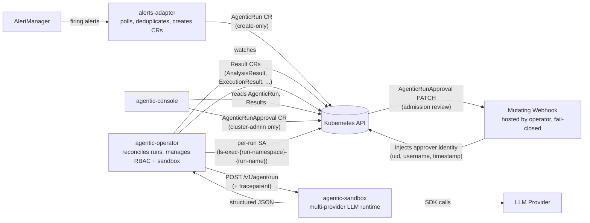
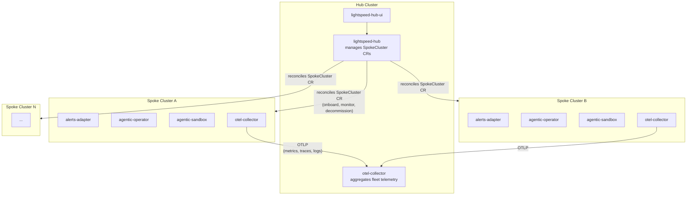
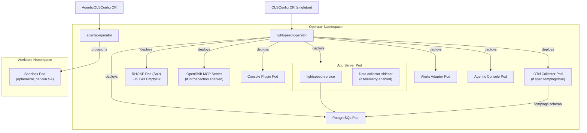
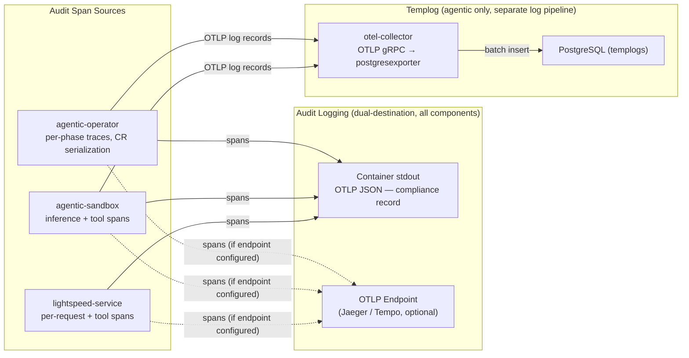
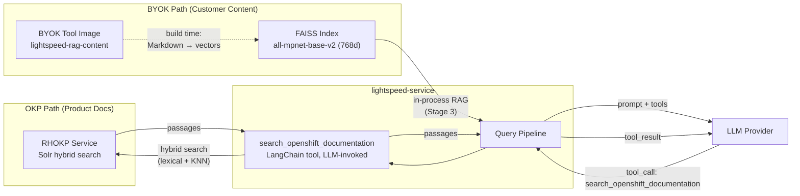

# OpenShift Lightspeed — Architecture

OpenShift Lightspeed (OLS) is an AI-powered platform for OpenShift clusters, composed of two LLM-backed subsystems:

- **Classic OLS** — an interactive Q&A assistant. Cluster administrators ask questions through the OpenShift console; the service routes them to configurable LLM providers (OpenAI, Azure, Anthropic, Gemini, Bedrock, WatsonX, RHELAI/vLLM), augments responses with retrieval from Red Hat product documentation (OKP/Solr hybrid search) and customer-supplied content (BYOK FAISS indexes), and can invoke external tools via MCP servers for live cluster introspection.

- **Agentic OLS** — an autonomous cluster management assistant. Triggered by AlertManager alerts, external integrations, or manual requests, it runs multi-phase workflows — analysis, remediation, and verification — powered by LLM reasoning. Per-action human approval gates ensure no cluster mutation happens without explicit cluster-admin consent.

A planned multicluster hub layer will extend both subsystems across a fleet of clusters.

The platform is built from the following core components:

- **lightspeed-operator** — central Kubernetes operator that configures the overall platform via the `OLSConfig` CRD, deploys and manages platform components (service, RHOKP, PostgreSQL, MCP server, OTel collector, console plugins, alerts adapter), and passes configuration to both the Classic OLS service and the agentic subsystem via generated ConfigMaps.
- **lightspeed-service** — implements the Classic OLS assistant as a FastAPI service. Handles the query pipeline, LLM provider integration, RAG retrieval, and MCP tool execution. Exposes a REST/SSE streaming API consumed by the console plugin.
- **lightspeed-agentic-operator** — the Agentic OLS workflow engine. Implements the autonomous workflow lifecycle (analysis → approval → execution → verification), provisioning ephemeral sandbox pods for each phase. Built as a Kubernetes operator.
- **lightspeed-agentic-sandbox** — ephemeral multi-provider LLM runtime that executes analysis, remediation, and verification phases inside isolated pods.
- **lightspeed-console** — OpenShift console plugin providing the Classic OLS chat interface.
- **lightspeed-agentic-console** — OpenShift console plugin providing the AI Hub UI for agentic workflow monitoring, approval, and escalation management.

Supporting components:

- **PostgreSQL** — overall persistence layer, used for conversation cache, token quota tracking, and templog audit storage.
- **RHOKP** — Red Hat product documentation served via Solr hybrid search (lexical + KNN vector reranking).
- **OpenShift MCP Server** — standalone HTTPS service for live cluster introspection via MCP protocol (Kubernetes resources, Helm, Prometheus metrics).
- **OTel Collector** — custom OpenTelemetry collector for fleet telemetry forwarding and templog audit storage in PostgreSQL.
- **Alerts adapter** — bridges AlertManager to the agentic system by polling firing alerts, deduplicating, and creating AgenticRun CRs.

The system spans 13 repositories organized into three layers (classic, agentic, multicluster) plus shared tooling.

> For machine-readable behavioral specs, see [`.ai/spec/`](.ai/spec/README.md). This document is a human-facing overview.
>
> **Convention:** Features marked `[PLANNED]` are designed but not yet implemented. Everything else is shipped.

---

## System Context

All repos grouped by product layer, with external dependencies.

---

## Classic OLS — Request Flow

A user asks a question in the console. The service processes it through an 8-stage pipeline and streams back an answer, optionally calling tools (MCP servers, OKP documentation search) along the way.

The context window is partitioned into three budgets: a **response reserve** (4096 tokens), a **tool reserve** (25% of context, configurable 10-60%; zero when no MCP servers are configured), and the **prompt budget** (remainder). RAG chunks, conversation history, and skill context compete for the prompt budget; the tool reserve is held back for tool call/result tokens during the LLM generation loop.

---

## Agentic OLS — Run Lifecycle

An AgenticRun progresses through a state machine driven by the agentic-operator. Each transition involves different components: the alerts-adapter triggers, the operator orchestrates, the sandbox executes LLM calls, and the console enables human approval.

**Phase derivation precedence** (derived from result conditions, not the workflow states above): EmergencyStopped > Escalated > Denied > Verified > Executed > Analyzed (NoActionRequired reason → NoActionRequired phase, otherwise → Proposed). EmergencyStopped can be entered from any non-terminal phase.

---

## Agentic OLS — Component Interaction

How the four agentic components interact through CRDs and HTTP APIs.

### Key CRDs

| CRD | API Group | Scope | Purpose |
|-----|-----------|-------|---------|
| `OLSConfig` | `ols.openshift.io/v1alpha1` | Cluster (singleton `cluster`) | Classic OLS configuration |
| `AgenticOLSConfig` | `agentic.openshift.io/v1alpha1` | Cluster (singleton `cluster`) | Agentic stack configuration (`spec.audit` `[PLANNED]`, `spec.templog`, `spec.suspended` kill switch) |
| `AgenticRun` | `agentic.openshift.io/v1alpha1` | Namespace | Workflow state machine |
| `AgenticRunApproval` | `agentic.openshift.io/v1alpha1` | Namespace | Approval decisions per stage, option selection, max attempts override (+ `spec.approver` injected by webhook) |
| `ApprovalPolicy` | `agentic.openshift.io/v1alpha1` | Cluster (singleton `cluster`) | Auto/manual gates per stage, max attempts, max concurrent runs |
| `Agent` | `agentic.openshift.io/v1alpha1` | Cluster | LLM provider + model selection |
| `LLMProvider` | `agentic.openshift.io/v1alpha1` | Cluster | Provider credentials + endpoint |
| `AnalysisResult` | `agentic.openshift.io/v1alpha1` | Namespace | Immutable analysis output |
| `ExecutionResult` | `agentic.openshift.io/v1alpha1` | Namespace | Immutable execution output |
| `VerificationResult` | `agentic.openshift.io/v1alpha1` | Namespace | Immutable verification output |
| `EscalationResult` | `agentic.openshift.io/v1alpha1` | Namespace | Immutable escalation output |
| `SpokeCluster` | TBD `[PLANNED]` | Cluster | Spoke cluster registration and lifecycle `[PLANNED]` |

---

## Multicluster OLS — Fleet Topology `[PLANNED]`

The hub cluster will manage a fleet of spoke clusters, each running the agentic stack. The hub aggregates proposals, alerts, and telemetry across the fleet. All multicluster components are designed but not yet implemented.

---

## Deployment Topology (Single Cluster)

The `lightspeed-operator` reconciles a single `OLSConfig` CR into all Classic OLS components. The `lightspeed-agentic-operator` is co-deployed and manages the agentic stack from `AgenticOLSConfig`.

> **Note:** The alerts adapter and agentic console are deployed by the lightspeed-operator. `[PLANNED: OLS-3236]` will add status conditions (`AlertsAdapterReady`, `AgenticConsolePluginReady`) and image override flags.
> The RHOKP standalone Deployment is omitted when `byokRAGOnly` is set to true in the OLSConfig CR.

---

## Observability Pipeline

### Audit Logging (dual-destination)

Each audit-significant datum is recorded exactly once as an OTel span or span event. Two exporters on the same TracerProvider produce two views:

1. **stdout** (always, OTLP JSON) — the compliance record, never truncated
2. **OTLP endpoint** (optional, if configured) — external trace backends like Jaeger or Tempo

Both the agentic system and Classic OLS emit to these two destinations.

### Templog (agentic only, separate system)

For environments without cluster logging or SIEM, a separate templog system stores agentic audit events in PostgreSQL via a custom OTel Collector. Templog uses OTLP **log records** (not spans) emitted by the agentic-operator and sandbox to a dedicated collector. This is independent of the audit span pipeline — both operate simultaneously. Controlled by `AgenticOLSConfig.spec.templog` (default: true).

### Correlation Keys

| System | Attribute | Format | Scope |
|--------|-----------|--------|-------|
| Agentic | `agentic_run.uid` | 32-char hex (CR `metadata.uid`, hyphens stripped) | Links all phase traces for one run |
| Classic OLS | `gen_ai.conversation.id` | UUID | Links all request traces in a conversation |

---

## RAG Architecture

Two retrieval paths serve different content sources with different embedding models. OKP provides Red Hat product documentation via a standalone Solr service; BYOK lets customers index their own Markdown content into FAISS.

| Path | Embedding Model | Dimensions | Retrieval |
|------|----------------|------------|-----------|
| OKP (product docs) | `ibm-granite/granite-embedding-30m-english` | 384 | Solr hybrid search (lexical edismax + KNN reranking) |
| BYOK (customer content) | `sentence-transformers/all-mpnet-base-v2` (default; configurable) | 768 | FAISS vector similarity |

The embedding model used to build indexes must be identical to the model used at query time — a model mismatch produces meaningless similarity scores.

---

## Repository Index

| Repo | Language | Purpose |
|------|----------|---------|
| `lightspeed-service` | Python | Backend: query pipeline, LLM integration, RAG, MCP tools |
| `lightspeed-operator` | Go | Deploys and manages all Classic OLS components |
| `lightspeed-console` | TypeScript | OpenShift console chat UI plugin |
| `lightspeed-rag-content` | Python | BYOK FAISS index tooling |
| `lightspeed-agentic-operator` | Go | Orchestrates AgenticRun workflows; includes `oc-agentic` CLI |
| `lightspeed-agentic-console` | TypeScript | AI Hub console UI plugin |
| `lightspeed-agentic-sandbox` | Python | Multi-provider agent runtime |
| `lightspeed-agentic-alerts-adapter` | Go | AlertManager → AgenticRun bridge |
| `lightspeed-hub` | Go | Multicluster hub operator `[PLANNED]` |
| `lightspeed-hub-ui` | TypeScript | Fleet management console UI plugin `[PLANNED]` |
| `lightspeed-otel-collector` | Go | Custom OTel Collector (OCB) — templog audit storage + fleet telemetry |
| `lightspeed-team-harness` | — | Shared AI coding skills |
| `ols-load-generator` | Go | Load testing tool |

---

## Key Architectural Decisions

- **Single operator, multiple operands.** The `lightspeed-operator` deploys the entire Classic OLS stack from one `OLSConfig` CR — no per-component operators. This reduces operational surface: one upgrade, one status, one set of RBAC. The operator also deploys the alerts adapter and agentic console as reconciled operands. `[PLANNED: OLS-3236]` will add dedicated status conditions and image override flags for these agentic operands.

- **OKP for Red Hat knowledge, BYOK for customer content.** OCP docs, errata, and runbooks are served by the standalone RHOKP service (Solr hybrid search), not bundled FAISS indexes. Solr hybrid search combines lexical recall (edismax) with semantic reranking (KNN), outperforming pure vector search on structured technical documentation. The RHOKP service is not deployed when `byokRAGOnly` is true. Customers bring their own content via the BYOK tool image and FAISS.

- **Per-run ServiceAccount isolation.** Each agentic execution gets an ephemeral SA (`ls-exec-{run-namespace}-{run-name}`) rather than a shared service account. This prevents cross-run permission leakage: if Run A needs `delete pods` and Run B needs `get secrets`, neither run inherits the other's permissions. Analysis and verification use a shared read-only SA (`lightspeed-agent`).

- **Cluster-admin approval gate.** Only `cluster-admin` or `kubeadmin` users can approve agentic run execution, enforced by Kubernetes RBAC on `AgenticRunApproval` resources via a dedicated `agentic-run-approver` ClusterRole. A mutating admission webhook on approval PATCH operations injects the approver's identity (uid, username, timestamp) for audit compliance. `[PLANNED]` Namespace-scoped delegation for non-cluster-admins.

- **Dual-destination audit logging.** Each audit-significant datum is recorded exactly once as an OTel span or span event. Two exporters produce two views: (1) stdout as OTLP JSON (always on — the compliance record, never truncated), and (2) an optional OTLP endpoint for external trace backends. The compliance record (stdout) is never lost even if the OTLP backend is unavailable. Separately, the templog system (default on, agentic only) stores audit events as OTLP log records in PostgreSQL via a custom OTel Collector — a stopgap for environments without cluster logging.

- **Hub-spoke multicluster model.** A central hub cluster manages spokes via `SpokeCluster` CRs on the hub's own Kubernetes API. Spokes run their own agentic stacks; the hub aggregates and coordinates. This avoids spoke-to-spoke coupling — each spoke's local agentic-operator continues to function without hub connectivity.

- **Multi-provider agent runtime.** The agentic-sandbox wraps LLM provider SDKs behind a unified `/v1/agent/run` endpoint. Three adapters: DeepAgents (LangChain `ChatAnthropic` / `ChatAnthropicVertex` / `ChatAnthropicBedrock` for Anthropic models), Gemini, and OpenAI. The original dedicated Claude adapter was removed in OLS-3473; Anthropic is now served through DeepAgents.
